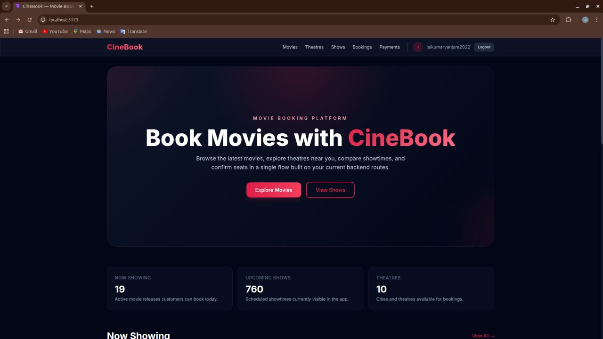
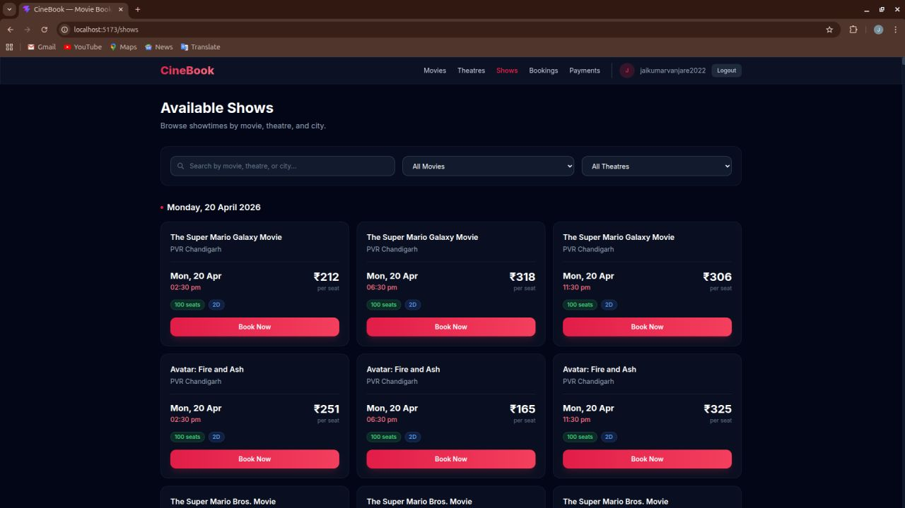
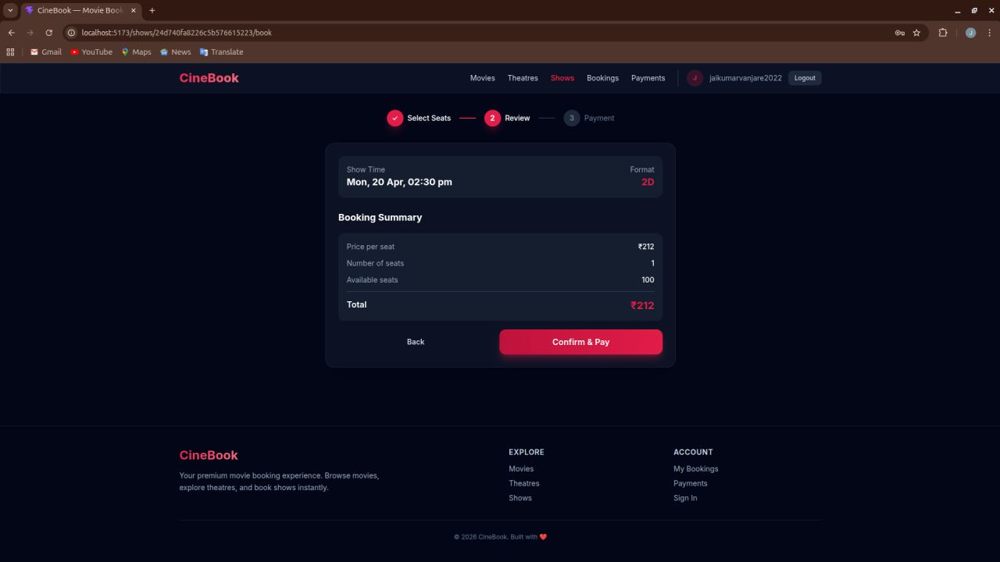
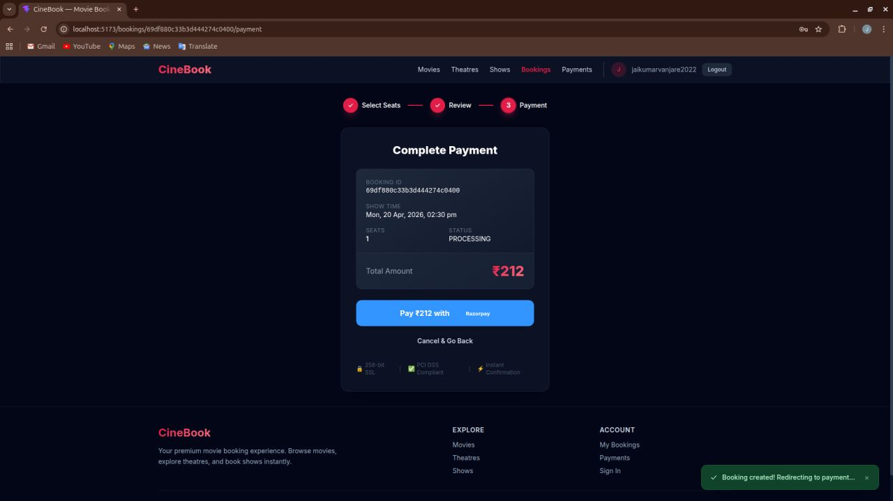

# CineBook

CineBook is a full-stack movie ticket booking application built using a multi-repository architecture. It allows users to browse movies, book seats, manage theatres, and receive booking notifications.

This repository is the **project showcase hub**. It documents the architecture, features, and setup — and links to the four code repositories.

---

## Features

- User authentication (JWT, role-based access)
- Browse movies with search and filters
- Theatre management (CLIENT role)
- Show scheduling and seat configuration
- Interactive seat selection
- Ticket booking with Razorpay payments
- Booking history
- Email notifications (async via BullMQ)
- Admin dashboard (web and mobile)

---

## Architecture

See **[docs/architecture.md](docs/architecture.md)** for the full system design.

| Document | Description |
|----------|-------------|
| [Architecture](docs/architecture.md) | System overview, components, and flows |
| [Database Schema](docs/database-schema.md) | MongoDB collections and relationships |
| [API Flow](docs/api-flow.md) | Booking and notification sequence |

---

## Tech Stack

**Frontend (Web)**
- React
- TypeScript
- Tailwind CSS
- Vite

**Mobile**
- Flutter
- Dart
- Provider

**Backend**
- Node.js
- Express
- Prisma ORM
- MongoDB

**Notification Service**
- Node.js
- Express
- TypeScript
- Redis
- BullMQ
- Nodemailer

**Others**
- JWT authentication
- Razorpay payments
- Swagger API docs
- Docker (optional)

---

## Repositories

| Repository | Description | Link |
|------------|-------------|------|
| **Backend** | Core API, auth, bookings, payments | [cinebook-backend](https://github.com/JaikumarVanjare/Movie_Booking_application) |
| **Frontend** | React web app for customers and admins | [cinebook-frontend](https://github.com/JaikumarVanjare/Movie_Booking_Application_Frontend) |
| **Notification Service** | Async email queue (BullMQ + Redis) | [cinebook-notification](https://github.com/JaikumarVanjare/NotificationService) |
| **Mobile** | Flutter app for booking and admin | [cinebook-mobile](https://github.com/JaikumarVanjare/Movie_Booking_Application_Mobile) |

> Admin features are built into the web frontend and mobile app — there is no separate admin repository.

---

## Screenshots

| Home | Show Selection |
|:----:|:----:|
|  |  |

| Seat Booking | Payment |
|:----:|:----:|
|  |  |

---

## Getting Started

Clone each repository and start the services in this order:

### Prerequisites

- Node.js 18+
- MongoDB
- Redis
- Flutter SDK (for mobile)

### 1. Notification Service

```bash
git clone https://github.com/JaikumarVanjare/cinebook-notification.git
cd cinebook-notification
npm install
cp .env.example .env
npm run dev
# In a second terminal:
npm run worker:dev
```

### 2. Backend API

```bash
git clone https://github.com/JaikumarVanjare/cinebook-backend.git
cd cinebook-backend
npm install
cp .env.example .env
npm run db:push
npm run seed
npm run dev
```

### 3. Web Frontend

```bash
git clone https://github.com/JaikumarVanjare/cinebook-frontend.git
cd cinebook-frontend
npm install
cp .env.example .env
npm run dev
```

### 4. Mobile App

```bash
git clone https://github.com/JaikumarVanjare/cinebook-mobile.git
cd cinebook-mobile
flutter pub get
flutter run
```

Ensure MongoDB and Redis are running before starting the backend and notification service.

---

## Environment Variables

Configure these in each service's `.env` file. **Do not commit actual secrets.**

### Backend

```env
PORT=
DATABASE_URL=
AUTH_KEY=
NOTI_SERVICE=
RAZORPAY_KEY_ID=
RAZORPAY_KEY_SECRET=
```

### Notification Service

```env
PORT=
LOCAL_DB_URL=
LOCAL_REDIS_URL=
EMAIL_USER=
EMAIL_PASS=
```

### Frontend

```env
VITE_API_BASE_URL=
VITE_API_TIMEOUT=
VITE_RAZORPAY_KEY_ID=
```

### Mobile

```env
API_BASE_URL=
RAZORPAY_KEY_ID=
```

---

## API Documentation

Once the backend is running:

| Resource | URL |
|----------|-----|
| Swagger UI | [http://localhost:3000/api-docs](http://localhost:3000/api-docs) |
| Backend API base | `http://localhost:3000/mba/api/v1` |
| Notification API base | `http://localhost:3001/notiservice/api/v1` |

---

## Future Improvements

- Online payments with Razorpay webhooks
- QR ticket verification at theatre entry
- Movie recommendations based on booking history
- Analytics dashboard with exportable reports
- Mobile push notifications

---

## Resume

Add this single link to your resume or portfolio:

```
GitHub: github.com/JaikumarVanjare/cinebook
```

Recruiters can open one repository to understand the project, read the architecture docs, view screenshots, and navigate to each code repository.

---

## License

This project is licensed under the [MIT License](LICENSE).
