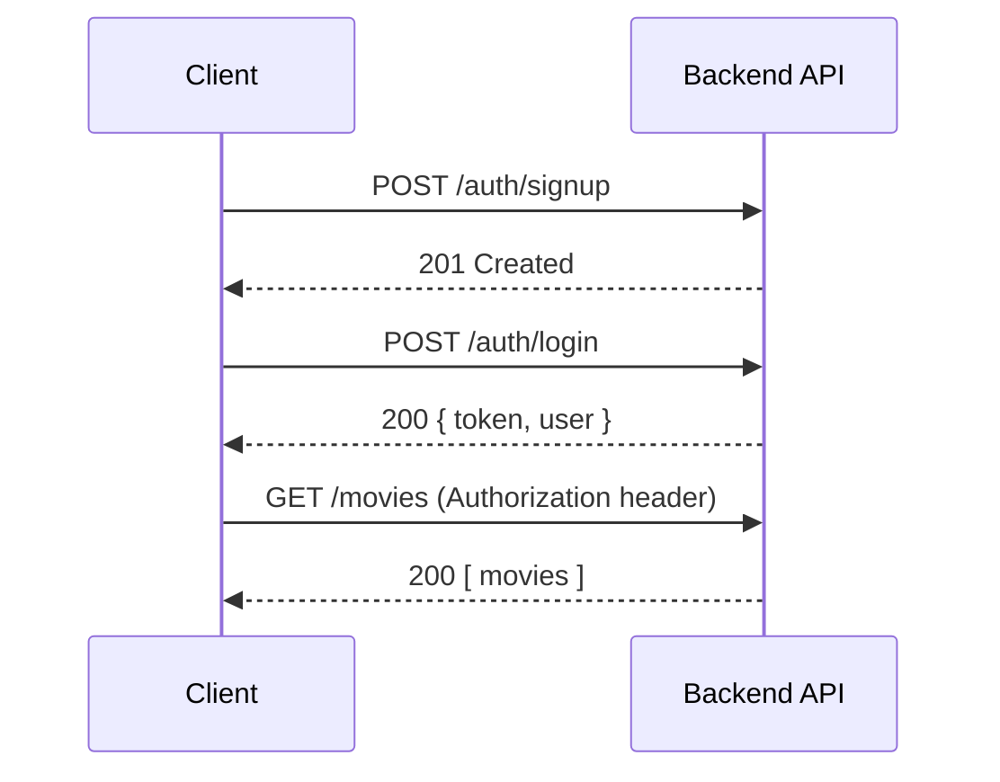
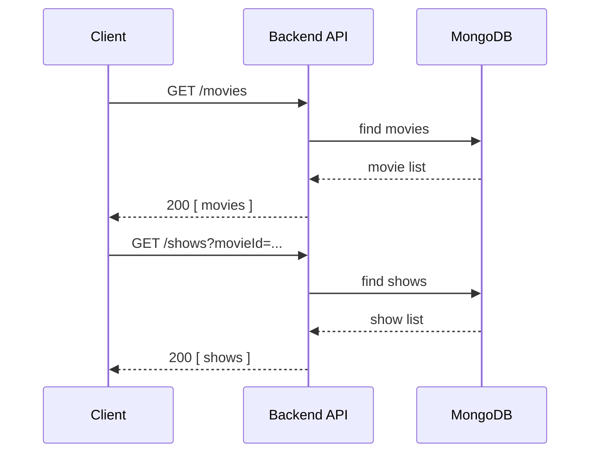
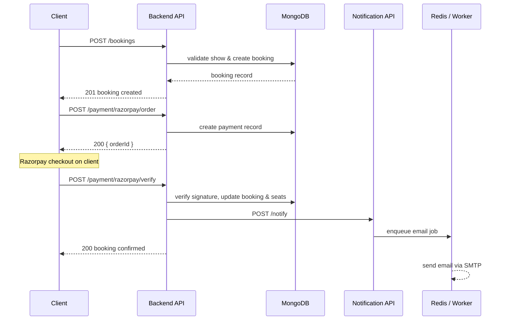
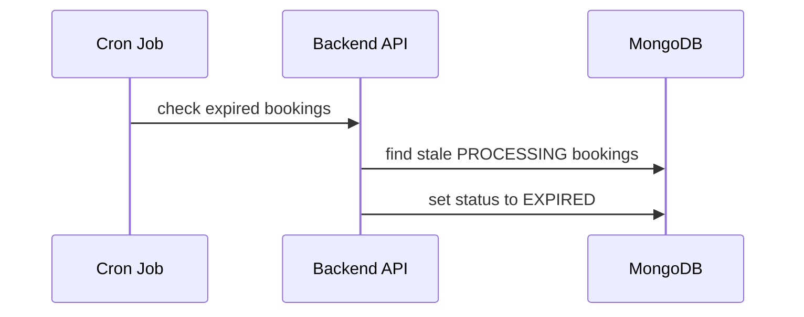
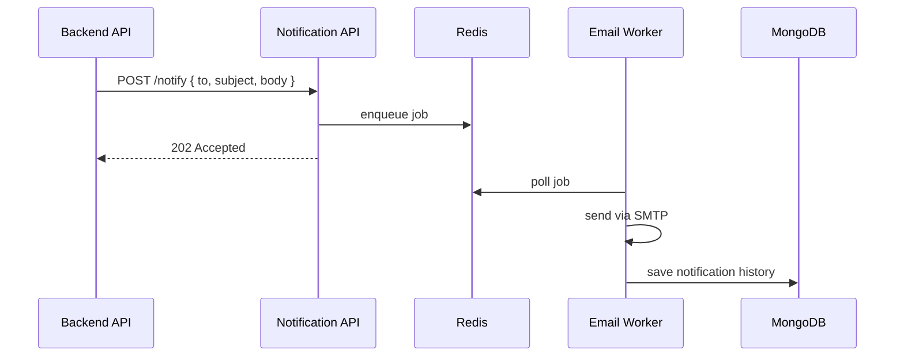

# CineBook API Flow

This document describes the main API request sequences across the CineBook platform.

---

## Base URLs

| Service | Base URL |
|---------|----------|
| Backend API | `http://localhost:3000/mba/api/v1` |
| Notification API | `http://localhost:3001/notiservice/api/v1` |
| Swagger UI | [http://localhost:3000/api-docs](http://localhost:3000/api-docs) |

---

## Table of Contents

1. [Authentication Flow](#1-authentication-flow)
2. [Movie Browse Flow](#2-movie-browse-flow)
3. [Booking & Payment Flow](#3-booking--payment-flow)
4. [Booking Expiration](#4-booking-expiration-cron)
5. [Notification Flow](#5-notification-flow)
6. [Admin Operations](#6-admin-operations)

---

## 1. Authentication Flow

**Endpoints:** `POST /auth/signup` · `POST /auth/login` · protected routes with `Authorization: Bearer <token>`

### Steps

| Step | Actor | Action |
|:----:|-------|--------|
| 1 | Client | `POST /auth/signup` with name, email, password |
| 2 | Backend | Creates user (`CUSTOMER` role is auto-approved) |
| 3 | Client | `POST /auth/login` with credentials |
| 4 | Backend | Returns JWT token and user profile |
| 5 | Client | Sends `Authorization: Bearer <token>` on all protected requests |
| 6 | Backend | Middleware verifies JWT and enforces role-based access |

### Sequence

---

## 2. Movie Browse Flow

**Endpoints:** `GET /movies` · `GET /shows?movieId=...`

### Steps

| Step | Actor | Action |
|:----:|-------|--------|
| 1 | Client | `GET /movies` to list available movies |
| 2 | Backend | Queries MongoDB and returns movie catalogue |
| 3 | Client | `GET /shows?movieId=<id>` for a selected movie |
| 4 | Backend | Returns show timings, theatres, prices, and seat availability |

### Sequence

---

## 3. Booking & Payment Flow

**Endpoints:** `POST /bookings` · `POST /payment/razorpay/order` · `POST /payment/razorpay/verify`

### Steps

| Step | Actor | Action |
|:----:|-------|--------|
| 1 | Client | `POST /bookings` with movie, theatre, timing, and seat count |
| 2 | Backend | Validates show, checks seat availability, creates booking (`PROCESSING`) |
| 3 | Client | `POST /payment/razorpay/order` to initiate payment |
| 4 | Backend | Creates Razorpay order and returns `orderId` |
| 5 | Client | Completes Razorpay checkout in the browser / app |
| 6 | Client | `POST /payment/razorpay/verify` with payment signature |
| 7 | Backend | Verifies signature, marks booking `SUCCESSFULL`, decrements seats |
| 8 | Backend | Calls notification service to send confirmation email |
| 9 | Client | Receives booking confirmation |

### Sequence

---

## 4. Booking Expiration (Cron)

Unpaid bookings in `PROCESSING` status are automatically expired by a scheduled cron job.

### Steps

| Step | Actor | Action |
|:----:|-------|--------|
| 1 | Cron job | Triggers on a fixed schedule |
| 2 | Backend | Finds bookings past the payment timeout |
| 3 | Backend | Updates status from `PROCESSING` to `EXPIRED` |

### Sequence

---

## 5. Notification Flow

**Endpoint:** `POST /notiservice/api/v1/notify`

### Steps

| Step | Actor | Action |
|:----:|-------|--------|
| 1 | Backend | `POST /notify` with recipient, subject, and body |
| 2 | Notification API | Accepts request and enqueues job in Redis (BullMQ) |
| 3 | Worker | Polls queue and sends email via Nodemailer (SMTP) |
| 4 | Notification API | Saves delivery record to MongoDB |

### Sequence

---

## 6. Admin Operations

| Action | Method | Endpoint | Required Role |
|--------|:------:|----------|---------------|
| Create movie | `POST` | `/movies` | `ADMIN` |
| Create theatre | `POST` | `/theatres` | `CLIENT`, `ADMIN` |
| Schedule show | `POST` | `/shows` | `CLIENT`, `ADMIN` |
| List all users | `GET` | `/users` | `ADMIN` |
| Approve / reject user | `PATCH` | `/users/:id/status` | `ADMIN` |

---

## Related Documentation

| Document | Description |
|----------|-------------|
| [Architecture](architecture.md) | System components and design decisions |
| [Database Schema](database-schema.md) | Data models and relationships |
